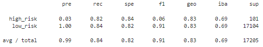
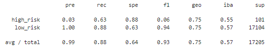

# Credit_Risk_Analysis

## Overview
Employ different techniques to train and evaluate models with unbalanced classes. Use imbalanced-learn and scikit-learn libraries to build and evaluate models using resampling. 

Using the credit card credit dataset from LendingClub, a peer-to-peer lending services company, oversample the data using the RandomOverSampler and SMOTE algorithms, and undersample the data using the ClusterCentroids algorithm. Then, use a combinatorial approach of over- and undersampling using the SMOTEENN algorithm. Next, compare two new machine learning models that reduce bias, BalancedRandomForestClassifier and EasyEnsembleClassifier, to predict credit risk. Evaluate the performance of these models and make a written recommendation on whether they should be used to predict credit risk.

## Results

Using bulleted lists, describe the balanced accuracy scores and the precision and recall scores of all six machine learning models. Use screenshots of your outputs to support your results.

### Oversampling
- The accuracy score is 0.8325468421491353.
- Confusion Matrix:

- Imbalanced Classification Report: 

### SMOTE Oversampling
- The accuracy score is 0.8440938486973113.
- Confusion Matrix:

- Imbalanced Classification Report: 

### Undersampling(Cluster Centroids)
- The accuracy score is 0.8203882595930314.
- Confusion Matrix: 

- Imbalanced Classification Report: 

### Combination (Over and Under) Sampling (SMOTEEN)
- The accuracy score is 0.844016280135965.
- Confusion Matrix:

- Imbalanced Classification Report: 

### Balanced Random Forest Classifier
- The accuracy score is 0.7589504857875872
- Confusion Matrix:

- Imbalanced Classification Report: 

- The features are sorted in descending order by feature importance:

### Easy Ensemble AdaBooster Classifier
- The accuracy score is 0.9319231677611166
- Confusion Matrix:

- Imbalanced Classification Report: 

## Summary
The resampling models and The BalancedRandomForestClassifier had low f1 scores(0.04-0.07).

The EasyEnsembleClassifier performed the best in classifying the credit risk as high risk with an f1 score of 0.16. Therefore, I would recommend using the EasyEnsembleClassifier to predict credit risk.
